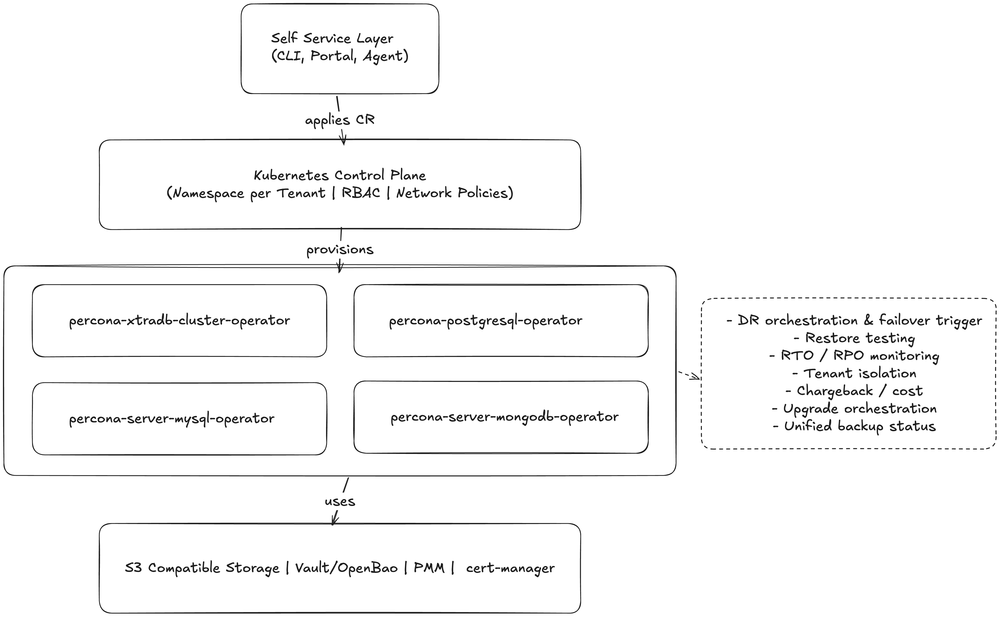

<!-- _class: cover -->


# Composing a Multi-Database DBaaS from Open Source Kubernetes Operators

**Percona Live 2026 Bay Area**

George Kechagias

---

## About Me


- **George Kechagias**
- Senior Software Engineer at **Percona**
- Working on the **Percona Kubernetes Operators**
- Based in Athens, Greece 🇬🇷

---

## The Problem with Managed DBaaS

- **Vendor lock-in**: your schema, your data, their API
- **Data ownership & sovereignty**: your data lives on their infrastructure under their terms so exit costs, jurisdiction, and access policies are theirs to set
- **Black box operations**: no visibility into backup internals, failover logic, or upgrade process
- **No debuggability**: when something breaks, you can't dig in; you open a ticket and wait
- **Cost at scale**: managed services charge a premium that compounds with every new database *(see yesterday's session with Kate for concrete numbers)*
- **Limited configurability**: can't tune engine parameters, choose storage classes, or customize topology

---

## What a Production DBaaS Must Provide

| Capability | Why it matters |
|---|---|
| **Automated deployment** | Operators, not humans, provision clusters |
| **High availability & failover** | Zero-downtime for production workloads |
| **Horizontal & vertical scaling** | Match resources to workload without rebuilding |
| **Full + incremental backups** | Balance storage cost with recovery granularity |
| **Point-in-time recovery (PITR)** | Recover to any second, not just the last backup |
| **Encryption at rest & in transit** | Compliance, security posture |
| **Monitoring & alerting** | Know before users do |
| **Self-service API** | Teams provision without opening a ticket |

---

## Why Kubernetes Operators?

- Operators encode **operational knowledge** as code: failover, backup, scaling are just control loops
- CRDs give you a **declarative, versioned API** for every database cluster
- Native integration with Kubernetes RBAC, Secrets, cert-manager, storage classes, and the wider ecosystem
- Portable across **any conformant Kubernetes cluster**: GKE, EKS, AKS, OpenShift, bare metal
- GitOps-friendly: entire database fleet managed as YAML in a repository

---

## Percona Operators: The Building Blocks

| Operator | Database | Engine |
|---|---|---|
| **Percona Operator for MySQL (PXC)** | MySQL | Percona XtraDB Cluster (Galera) |
| **Percona Operator for MySQL (PS)** | MySQL | Percona Server for MySQL (Group Replication) |
| **Percona Operator for MongoDB** | MongoDB | Percona Server for MongoDB |
| **Percona Operator for PostgreSQL** | PostgreSQL | Percona Distribution for PostgreSQL |

All four are **open source**, Apache 2.0 licensed

---

## Deployment & Automated Scaling

**Out of the box with all operators:**

- Single CR to deploy a full HA cluster, no manual pod wiring
- **Horizontal scaling**: edit the engine-specific size field: `spec.pxc.size` (PXC), `spec.mysql.size` (PS), `spec.replsets[].size` (PSMDB), `spec.instances[].replicas` (PG)
- **Vertical scaling**: resize CPU/memory requests and limits in-place
- **Self-healing**: failed pods are automatically detected and rescheduled; cluster topology is reconciled continuously
- Anti-affinity rules keep replicas spread across nodes and availability zones
- Pause/resume clusters (scale to zero) for dev/staging environments

---

## High Availability & Failover

**MySQL (PXC):** Galera synchronous multi-primary replication. Any node can accept writes; no election needed on failure.

**MySQL (PS):** Group Replication (GR) with single-primary or multi-primary modes.

**MongoDB:** Replica sets with automatic primary election; arbiter and non-voting node support for cost-optimised topologies; sharding for horizontal data distribution.

**PostgreSQL:** Streaming replication with Patroni-based automatic failover within the cluster.

---

## Full Cluster Crash Recovery

When every node goes down at once the operators bring the cluster back without manual surgery:

- **MySQL (PXC):** automatic Galera cluster bootstrap. The operator picks the most advanced node as the source of truth.
- **MySQL (PS):** GR cluster reboot from the most up-to-date member.
- **MongoDB (PSMDB):** pods come back, the replica set elects a new primary on its own; if quorum can't form (e.g. stale rs config), the operator force-reconfigures via `replSetReconfig` as a fallback.
- **PostgreSQL:** Patroni-driven recovery. Leader election resumes once nodes come back; PITR fills the gap if data is lost.

---

## Backups: Full, Differential & Incremental

**The tools under the hood:**

| Operator | Tool | Backup types |
|---|---|---|
| MySQL (PXC) | Percona XtraBackup (PXB) | Full |
| MySQL (PS) | Percona XtraBackup (PXB) | Full + incremental |
| MongoDB | Percona Backup for MongoDB (PBM) | Logical, physical, incremental |
| PostgreSQL | pgBackRest | Full, differential, block-level incremental |

---

## Backups: Scheduling & Retention

Cron-based schedules defined directly in the cluster CR, no external CronJob needed:

```yaml
backup:
  schedule:
    - name: daily-full
      schedule: "0 2 * * *"
      keep: 7
      storageName: s3-us-east
    - name: hourly-incremental
      schedule: "0 * * * *"
      keep: 24
      storageName: s3-us-west
```

- Retention policy (`keep`) handled by the operator
- On-demand backups via a dedicated Backup CR: `PerconaXtraDBClusterBackup` (PXC), `PerconaServerMySQLBackup` (PS), `PerconaServerMongoDBBackup` (PSMDB), `PerconaPGBackup` (PG)
- Same pattern applies across all four operators

---

## Point-in-Time Recovery (PITR)

Recover to **any arbitrary moment**, not just the last backup checkpoint.

| Operator | Continuous log stream |
|---|---|
| MySQL (PXC / PS) | Binary logs → S3 (compatible) / GCS / Azure |
| MongoDB | Oplog via PBM → S3 (compatible) / GCS / Azure |
| PostgreSQL | WAL archiving via pgBackRest → S3 (compatible) / GCS / Azure |

---

```yaml
apiVersion: ps.percona.com/v1
kind: PerconaServerMySQLRestore
spec:
  clusterName: prod-mysql
  backupName: daily-full-2026-05-06
  pitr:
    type: date
    date: "2026-05-06T14:32:00Z"
```

```yaml
apiVersion: ps.percona.com/v1
kind: PerconaServerMySQLRestore
spec:
  clusterName: prod-mysql
  backupName: daily-full-2026-05-06
  pitr:
    type: gtid
    gtid: "a3e5ff70-83e2-11ef-8e57-7a62caf7e1e3:1-36"
```

---

## Disaster Recovery: What the Operator Does

**Cross-region / cross-cloud standby clusters**, synced through object storage, no direct network link required between sites.

| Operator | DR primitive |
|---|---|
| PostgreSQL | pgBackRest repo-based standby + streaming replication |
| MySQL (PXC) | Cross-site replication between Galera clusters via `replicationChannels` |
| MySQL (PS) | Cross-site replication for GR planned (1.2.0 roadmap) |
| MongoDB | Cross-region replica set members / dedicated DR shards |

---

**Promotion is declarative**: flip a flag in the CR and the standby becomes a writable primary:

```yaml
# PostgreSQL: promote a standby cluster
spec:
  standby:
    enabled: false
```

> The operator gives you the *mechanism* for DR. The *policy* is yours to write.

---

## Disaster Recovery: What the Operator Does NOT Do

Per the [Percona DR for PostgreSQL on Kubernetes](https://www.percona.com/blog/disaster-recovery-for-postgresql-on-kubernetes/) playbook: *"Full automation is beyond the Operator's scope."*

| Gap | What you must build |
|---|---|
| **Outage detection & failover trigger** | Cross-cluster health probes + decision engine |
| **Split-brain prevention** | Fence / shut down the old primary *before* promoting standby |
| **Application traffic redirection** | Global LB, Multi-Cluster Services, or service-mesh federation |
| **Recovery Time Objective (RTO) / Recovery Point Objective (RPO) enforcement** | Continuous lag monitoring, restore drills, recovery SLOs |

---

## Encryption in Transit

All operators ship with **TLS/SSL by default** for:
- Client-to-database connections
- Intra-cluster replication traffic
- Backup storage communication

**Certificate management options:**
- **cert-manager** integration (recommended): automatic issuance and rotation
- Manual certificate injection via Kubernetes Secrets
- Self-signed certificates generated by the operator (dev/staging)

---

## Encryption at Rest

- **MySQL (PXC, PS):** MySQL keyring plugin: encrypts InnoDB tablespaces and redo/binlog/undo logs. Key stored in a Kubernetes Secret or HashiCorp Vault via `spec.vaultSecretName`.
- **MongoDB (PSMDB):** WiredTiger storage-engine encryption, **enabled out of the box** via `spec.secrets.encryptionKey`. Vault and keyfile options also supported.
- **PostgreSQL:** not yet supported by the operator, **planned via [`pg_tde`](https://docs.percona.com/pg-tde/)**, Percona's Transparent Data Encryption extension.

---

## Monitoring & Observability

All operators integrate natively with **Percona Monitoring and Management (PMM)**:

- Per-query performance metrics, slow query analysis
- Replication lag, backup status, cluster health dashboards
- Alerting rules out of the box

**Enable PMM in the cluster CR:**
```yaml
pmm:
  enabled: true
  serverHost: pmm.monitoring.svc
  image: percona/pmm-client:3
```

---

**Beyond PMM:**
- Operator metrics exposed as Kubernetes Events and CR status fields
- Compatible with Prometheus + Grafana for existing stacks
- Backup CR status queryable via `kubectl`, scriptable for alerting pipelines

- **[Coroot](https://coroot.com/):** eBPF-based observability that auto-collects metrics, logs, traces, and profiling across every database and dependency.

---

## API Similarity: Custom Resources Across Operators

| Concern | MySQL (PXC) | MySQL (PS) | MongoDB | PostgreSQL |
|---|---|---|---|---|
| Cluster CR | `PerconaXtraDBCluster` | `PerconaServerMySQL` | `PerconaServerMongoDB` | `PerconaPGCluster` |
| Backup CR | `PerconaXtraDBClusterBackup` | `PerconaServerMySQLBackup` | `PerconaServerMongoDBBackup` | `PerconaPGBackup` |
| Restore CR | `PerconaXtraDBClusterRestore` | `PerconaServerMySQLRestore` | `PerconaServerMongoDBRestore` | `PerconaPGRestore` |
| Users | `spec.users[]` | `spec.users[]` *(coming soon)* | `spec.users[]` | `spec.users[]` |
| TLS | `spec.tls` | `spec.tls` | `spec.tls` | `spec.tls` |
| Monitoring | `spec.pmm` | `spec.pmm` | `spec.pmm` | `spec.pmm` |
| Backup schedule | `spec.backup.schedule[]` | `spec.backup.schedule[]` | `spec.backup.tasks[]` | `spec.backups.pgbackrest.repos[].schedules` |

---

## What You Get Out of the Box: Lifecycle

- Full HA cluster from a single CR, no manual pod wiring
- Automated failover with no manual intervention
- Horizontal and vertical scaling
- Self-healing pod recovery
- Cluster pause/resume (scale to zero for dev/staging)
- GitOps compatibility: all config is declarative YAML

---

## What You Get Out of the Box: Data & Security

- Scheduled + on-demand backups to object storage
- Point-in-time recovery (PITR)
- Encryption at rest and in transit
- TLS with cert-manager or self-signed certificates
- HashiCorp Vault integration for key management (PXC, PS, PSMDB)
- PMM monitoring integration out of the box
- Multi-cloud / multi-region deployment support

---

## The Gaps: Platform Layer

| Gap | What to build |
|---|---|
| **Self-service portal** | UI or CLI or Agents, so teams request databases without touching YAML |
| **Tenant isolation** | Namespaces, NetworkPolicies, resource quotas |
| **Credential vending** | Automate Secret delivery via ESO, Vault/OpenBao Integration |
| **Chargeback / cost visibility** | Resource tagging, namespace-level cost attribution |

---

## The Gaps: Operations Layer

| Gap | What to build |
|---|---|
| **Restore testing** | Spin up shadow cluster, restore, validate, destroy on a schedule |
| **Unified backup status** | Single pane of glass across all operator backup CRs |
| **SLA enforcement** | Backup age alerts, PITR gap monitoring, Recovery Time Objective (RTO) validation |
| **Upgrade orchestration** | Rolling upgrades coordinated with application teams |

---

## Architecture: A Unified DBaaS Layer

<p style="text-align: center;"></p>

---

## Production Trade-offs to Expect

- **Operator version drift**: four operators, four release cadences; pin versions and test upgrades in staging
- **Backup storage costs**: incremental backups + continuous WAL/binlog/oplog shipping adds up; set lifecycle policies on your storage buckets
- **Multi-tenancy complexity**: namespace isolation is safe but multiplies operator instances; cluster-wide operators reduce overhead but share blast radius
- **Galera vs. Group Replication**: PXC (Galera) and PS (GR) take different approaches to synchronous-style replication. Trade-offs in conflict handling, write latency, and topology flexibility; evaluate per workload
- **No managed SLA**: you own the on-call rotation; invest in runbooks and tested restore procedures before going to production

---

## Key Takeaways

1. **Operators give you the DBaaS engine**: HA, backups, PITR, encryption, scaling, declarative
2. **PITR + incremental backups**: full backups alone are not a recovery strategy
3. **Encryption is built in**: enable it from day one, not as a retrofit
4. **CR consistency across operators** makes a multi-database platform manageable
5. **The gaps are real but manageable**: the self-service layer, tenant isolation, and restore testing

---

## Q&A

**Resources:**
- [Percona Operator for PostgreSQL](https://docs.percona.com/percona-operator-for-postgresql/latest/)
- [Percona Operator for MySQL (PXC)](https://docs.percona.com/percona-operator-for-mysql/pxc/)
- [Percona Operator for MySQL (PS)](https://docs.percona.com/percona-operator-for-mysql/ps/)
- [Percona Operator for MongoDB](https://docs.percona.com/percona-operator-for-mongodb/)
- [Percona Community Forum](https://forums.percona.com/)
- [Percona GitHub](https://github.com/percona)
- [Repository of this slides deck](https://github.com/gkech/percona-live-2026-bay-area-slides)
